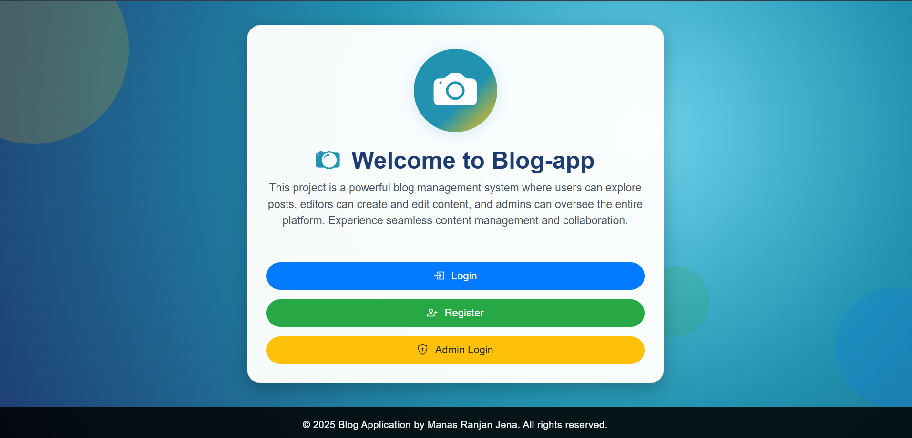
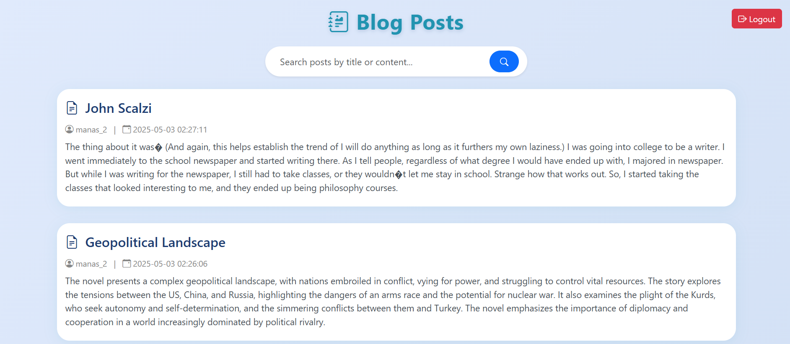

# Blog App Using PHP

Welcome to **Blog App Using PHP**! 🚀  
A simple, modern, and responsive blog platform built with PHP and MySQL.

---

## 🌟 Features

- 📝 Create, edit, and delete blog posts
- 👤 User authentication (login/register)
- 💬 Comment system
- 🎨 Responsive & clean UI
- 🔒 Secure with prepared statements

---

## 🚀 Getting Started

### 1. Clone the Repository

```bash
git clone https://github.com/ManasRanjanJena6/blog_app_using_php.git
```

### 2. Import the Database

- Open `phpMyAdmin`
- Create a new database (e.g., `blog`)
- Import the provided `.sql` file

### 3. Configure Database Connection

Edit `db.php` with your database credentials:

```php
$host = 'localhost';
$user = 'your_db_user';
$pass = 'your_db_password';
$db   = 'blog';
```

### 4. Run Locally

- Place the project in your XAMPP `htdocs` folder
- Start Apache & MySQL from XAMPP
- Visit [http://localhost/blog_app_using_php](http://localhost/blog_app_using_php)

---

## 🌐 Live Demo

Check out the live version:  
👉 [https://blog-app.lovestoblog.com/](https://blog-app.lovestoblog.com/)

---

## 🌐 Deploy Online (InfinityFree Example)

1. [Sign up for InfinityFree](https://infinityfree.net/)
2. Create a new account and upload your files to the `htdocs` folder
3. Create a MySQL database and import your `.sql` file
4. Update `db.php` with your InfinityFree credentials

---

## 📸 Screenshots




---

## 🤝 Contributing

Pull requests are welcome! For major changes, please open an issue first.

---

## 📄 License

This project is open source and available under the [MIT License](LICENSE).

---

> Made with ❤️ using PHP & MySQL
